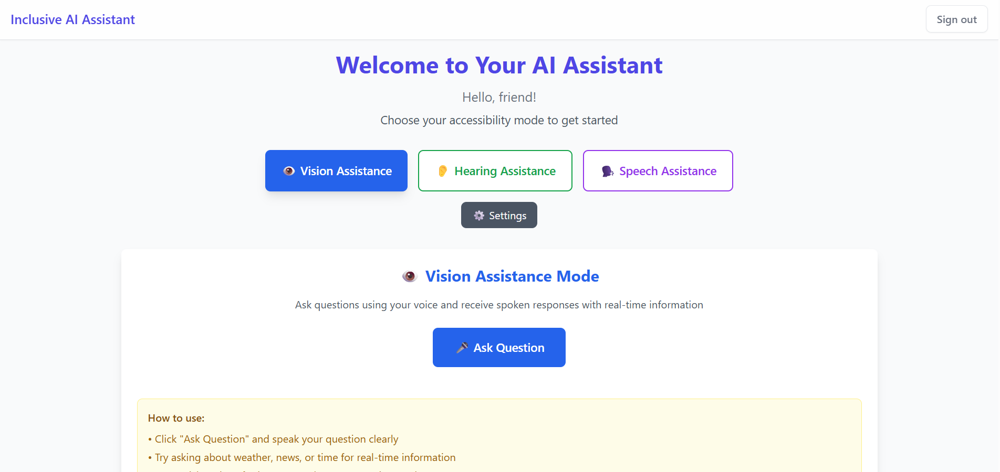
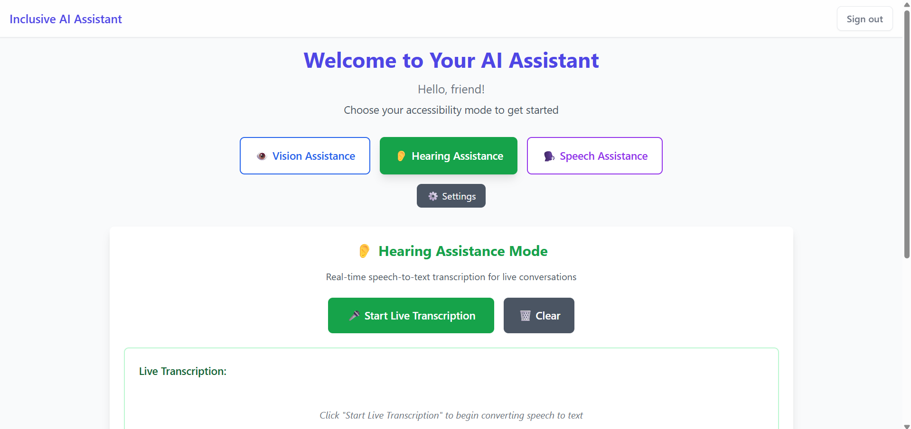
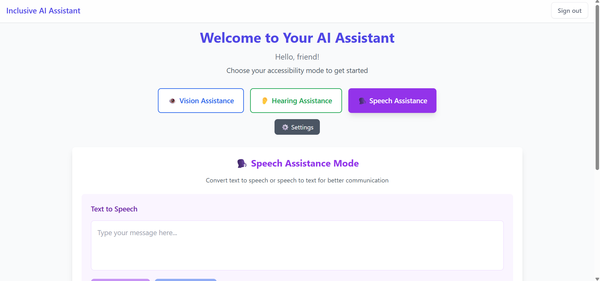

# AssistPlus

AssistPlus is a web-based assistive system designed to improve accessibility and communication for differently-abled users. The platform combines voice interaction, real-time speech-to-text transcription, and text-to-speech support into a single accessible environment.

## 🌟 Features

### 🎤 Voice Assistance (Vision Mode)
- Users can interact with the system through voice commands.
- The system responds using both voice and text.

### 👂 Live Transcription (Hearing Mode)
- Converts surrounding speech into real-time text.
- Helps users understand spoken communication instantly.

### 🗣️ Text-to-Speech (Speech Mode)
- Converts typed text into spoken output.
- Supports users with speech or communication difficulties.

### ⚡ Real-Time Processing
- Instant responses with minimal delay.

### ☁️ Cloud Storage
- Saves transcription history securely.

### 🔐 User Authentication
- Supports sign-in and anonymous access.

## 👥 Target Users

AssistPlus is designed primarily for:
- Visually impaired users
- Hearing impaired users
- Speech-impaired users
- General users requiring accessibility support

## 🛠️ Tech Stack

### Frontend
- React
- TypeScript
- Tailwind CSS

### Backend / Cloud
- Convex (Database, Authentication, Backend Logic)

### Speech & Audio
- Web Speech API
- Speech Recognition (Speech → Text)
- Speech Synthesis (Text → Speech)

### Deployment
- Docker

### Platform
- Web Application

## 📸 Project Screenshots

### Home Page

### Vision Mode

### Hearing Mode

### Speech Mode

## 🚀 Purpose

The goal of AssistPlus is to provide an inclusive and accessible digital experience by combining multiple accessibility features into one platform, helping users communicate and interact more independently.

## 📌 Future Improvements
- Multi-language support
- Improved speech accuracy
- Accessibility personalization
- Advanced voice assistant features
